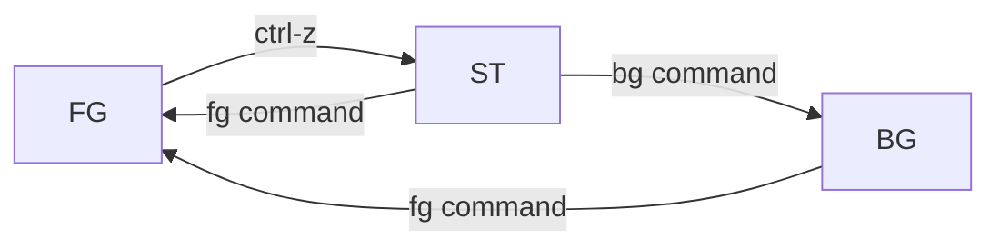
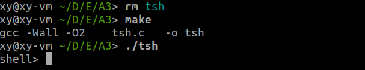
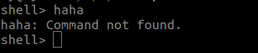
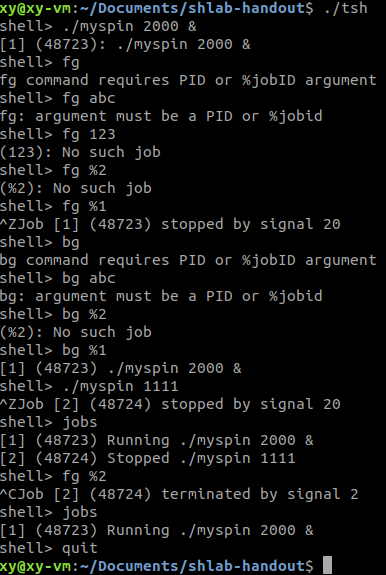
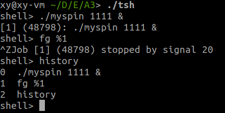
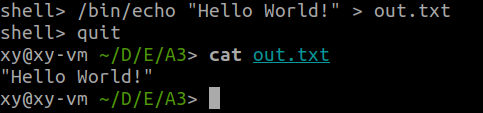

# Overview of Unix Shells

Reference: CMU CS213 [Lab5](http://csapp.cs.cmu.edu/3e/labs.html)

A shell is an interactive command-line interpreter that runs programs on behalf of the user. A shell repeatedly prints a prompt, waits for a command line on `stdin`, and then carries out some action, as directed by the contents of the command line.

The command line is a sequence of ASCII text words delimited by whitespace. 

- The first word in the command line is either 

  - the name of a built-in command or
    - the shell immediately executes the command in the current process.
  - the pathname of an executable file. 
    - the shell forks a child process, then loads and runs the program in the context of the child.

- The remaining words are command-line arguments. 

  

The child processes created as a result of interpreting a single command line are known collectively as a **job**. In general, a job can consist of multiple child processes connected by Unix pipes.  

- If the command line ends with an **ampersand ”&”**, then the job runs in the background, which means that the shell does not wait for the job to terminate before printing the prompt and awaiting the next command line. 
- Otherwise, the job runs in the foreground, which means that the shell waits for the job to terminate before awaiting the next command line. 

Thus, at any point in time, **at most one job can be running in the foreground.** However, **an arbitrary number of jobs can run in the background.**

# Code Logic

the basic logic is referred from CMU CS213 [Lab5](http://csapp.cs.cmu.edu/3e/labs.html)

1. display a prompt

2. read the input

3. call `parseline()` 

   - parse the space-separated command-line arguments
   - build the `argv` vector
   - return $bg$
     - if $argv[-1] == \&$, return 1, representing execute the program in the background
     - otherwise, return 0, run the program in the foreground (shell waits for it to complete)
4. if $argv[0] == NULL$: no input, simply return  

5. call `builtin_cmd()`

  - if $arg[0]$ is the name of a built-in shell command: interpret immediately, then return 1 
  - if $argv[0]$ is an executable file: return 0

6. if `builtin_cmd()` returns 0, i.e., not a builtin command:

   - `fork()`: create a child process
   - `execve()`
   - bg?
     - if $bg$: return to the next iteration
     - if not: use `waitfg()` to wait for the foreground job to terminate. When the job terminates, the shell goes on to the next iteration

# Code Explanation

Job is the core concept in the shell. At any point in time, **at most one job can be running in the foreground.** However, **an arbitrary number of jobs can run in the background.**

## 1. Data Structure - job

### 1.1 Definition

A struct is defined to describe the job:

```C
/* Job states */
#define UNDEF 0 /* undefined */
#define FG 1    /* running in foreground */
#define BG 2    /* running in background */
#define ST 3    /* stopped */

struct job_t {              /* The job struct */
    pid_t pid;              /* job PID */
    int jid;                /* job ID [1, 2, ...] */
    int state;              /* UNDEF, BG, FG, or ST */
    char cmdline[MAXLINE];  /* command line */
};

struct job_t jobs[MAXJOBS]; /* The job list */
```

> Note: since we didn't consider pipe, so every job has only one process. Otherwise, field `pid` should be an array.

At most 1 job can run in foreground, i.e., in the FG state.

A global `job_t` type array `jobs` is defined to keep track all jobs.

### 1.2 State Transition



### 1.3 Operations of job

```c
void clearjob(struct job_t *job); /* Clear the entries in a job struct */
void initjobs(struct job_t *jobs);/* Initialize the job list */
int maxjid(struct job_t *jobs);		/* Returns largest allocated job ID */
int addjob(struct job_t *jobs, pid_t pid, int state, char *cmdline);/* Add a job to the job list */
int deletejob(struct job_t *jobs, pid_t pid);/* Delete a job whose PID=pid from the job list */
pid_t fgpid(struct job_t *jobs);/* Return PID of current foreground job, 0 if no such job */
struct job_t *getjobpid(struct job_t *jobs, pid_t pid);/* Find a job (by PID) on the job list */
struct job_t *getjobjid(struct job_t *jobs, int jid);/* Find a job (by JID) on the job list */
int pid2jid(pid_t pid);/* Map process ID to job ID */
void listjobs(struct job_t *jobs); /* Print the job list */
```

## 2. Shell Functionality

1. Cancellation: Handle `ctrl-c` input, using it to terminate a currently-executing child process rather than the shell program itself.

2. History: Implement a history built-in command that will display all of the commands that the user has typed in this session.

3. Redirection: Allow a program’s standard output (stdout) or standard error output (stderr) to be redirected to a file using `>`, respectively.

4. Suspension: Handle `ctrl-z` input, using it to suspend a currently-executing child process rather than the shell program itself.
5. job control:
   1. The `quit` command terminates the shell.
   2. The `jobs` command lists all background jobs.
   3. The `bg <job>` command restarts <job> by sending it a SIGCONT signal, and then runs it in
      the background. The <job> argument can be either a PID or a JID.
   4. The `fg <job>` command restarts <job> by sending it a SIGCONT signal, and then runs it in
      the foreground. The <job> argument can be either a PID or a JID.
   5. Auto job management: 
      1. reap all of its zombie children
      2. delete or add job 

## 3. Pseudo code

```c
int main(int argc, char **argv)
{
	Signals(); //install the signal handlers
    initjobs(jobs);
    while(1){
        display prompt;
        cmdline = read from user input;
        history_add(cmdline); //add to the history;
        evaluate(cmdline); //evaluate the command line
    }
    exit(0);
}

void evaluate(cmdline)
{
    argv = parseline(cmdline);
    find '>';
    if(not builtin_cmd){
        if((pid = fork()) == 0){
            if('>' found)
                process redirection;
            execve(argv[0]);
            exit(0);
        }else{
            addjob;
            if(not background command)
                wait foreground command;
            else
        }
    }
}
```


## 4. Main ideas

### 4.1 Multi-process

In order to run different process, we must create a new process when we want to launch a new job. Otherwise, if there is only one process, we can't do different tasks at the same time. 

Hence, we must use `fork()`. When a child process terminates or stops, the kernel sends a `SIGCHLD` signal (number 17) to the parent. We use `SIGCHLD` to delete a job. So we have to handle this signal: 1. reap zombies using `waitpid`; 2. delete the job 

### 4.2 System Call Error Handling

Reference: CSAPP section 8.3

Use error handling wrappers. For a given base function `foo`, we define a wrapper function `Foo` with identical arguments but with the first letter of the name capitalized. 

Also we use wrapper for simplicity.

We define the following wrappers in the code:

```c
pid_t Fork(void);
void Kill(pid_t pid, int signum);
typedef void handler_t(int);
handler_t *Signal(int signum, handler_t *handler);
void Sigfillset(sigset_t *set);
void Sigemptyset(sigset_t *set);
void Sigaddset(sigset_t *set, int signum);
void Sigprocmask(int how, const sigset_t *set, sigset_t *oldset);
```

### 4.3 Safe signal handling 

Reference: CSAPP section 8.5.5

#### Ground rules

1. G0: Keep handlers as simple as possible.

2. G1: Call only async-signal-safe functions in your handlers. Thus we define some safe I/O functions to safely generate output from a signal handler. However, they don't support format output. So we have to use `printf()` if we want format output.

   ```C
   ssize_t sio_puts(char s[]);
   void sio_error(char s[]);
   ssize_t Sio_puts(char s[]);
   void Sio_error(char s[]);
   ```

3. G2: Save and restore `errno`. Do this when the signal handler return rather than call `exit()`.

4. G3: Protect accesses to shared global data structures by blocking all signals. 

   `jobs` is a global data structure, so whenever access `jobs` in the signal handlers, block all signals. This will eliminate race - a classic synchronization error. 

#### detailed strategy

Reference: CSAPP Shell Lab instructions

1. use `while` loop to reap as many as zombie children in `SIGCHLD` handler. use `WUNTRACED |WNOHANG` options in `waitpid`.

2. In `eval`, the parent must use `sigprocmask` to block `SIGCHLD` signals before it forks the child,
   and then unblock these signals, again using `sigprocmask` after it adds the child to the job list by
   calling `addjob`. Since children inherit the blocked vectors of their parents, the child must be sure
   to then unblock `SIGCHLD` signals before it execs the new program. 

   The parent needs to block the `SIGCHLD` signals in this way in order to avoid the race condition where
   the child is reaped by sigchld handler (and thus removed from the job list by calling `deletejob`) before the parent calls `addjob`.

3. When you run your shell from the standard Unix shell, your shell is running in the foreground process
   group. If your shell then creates a child process, by default that child will also be a member of the
   foreground process group. Since typing `ctrl-c` sends a `SIGINT` to every process in the foreground
   group, typing `ctrl-c` will send a `SIGINT` to your shell, as well as to every process that your shell
   created, which obviously isn’t correct.
   Here is the workaround: After the fork, but before the `execve`, the child process should call
   `setpgid(0, 0)`, which puts the child in a new process group whose group ID is identical to the
   child’s PID. This ensures that there will be only one process, your shell, in the foreground process
   group. When you type `ctrl-c`, the shell should catch the resulting `SIGINT` and then forward it
   to the appropriate foreground job (or more precisely, the process group that contains the foreground
   job).

## Usage and output

helper programs:

- `myspin.c`: Takes argument <n> and spins for <n> seconds

### 1. Make and run



### 2. Feature Usage and output

1. wrong command



2. job control 
   1. launch a new background job
   2. make it foreground with wrong or right arguments
   3. stop it by keyboard `ctrl-z` (**Suspension**)
   4. make it background with wrong or right arguments
   5. launch a foreground job
   6. stop it by keyboard `ctrl-z`
   7. display all jobs
   8. restart it by `fg`
   9. terminate it by keyboard `ctrl-c`(**Cancellation**)
   10. display all jobs
   11. exit the shell



3. Display **history**

   

4. **Redirection**

