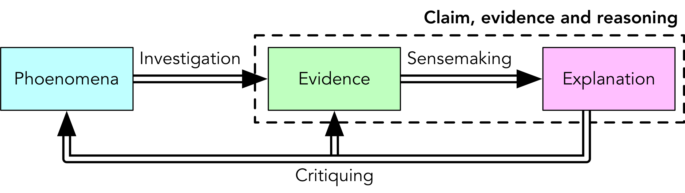

# Lab Report Guide

A guide to my expectations for lab reports that you submit in this course.

Labs are about **understanding and explaining** the behaviour of systems using **theory and observations**. We investigate phenomena Conclusions drawn in a lab report should include explicit **claims** that are supported by **evidence** (observations) using appropriate **reasoning** (showing how the evidence supports the claim).

## Claim–Evidence-Reasoning

The "Claim–Evidence–Reasoning" model is a method of **sensemaking**: interpreting evidence to explain how we can know something. We will be looking for claims, evidence and reasoning in your lab reports; you would do well to put them in, clearly and explicitly.

Given a question, you first need to consider what precise **claim** (or claims) you wish to investigate via the production of evidence. A question may have different answers under different conditions, or terms may be used that require greater precision. One question may be answered by several claims, and there may be more than one way of getting at the answer.

In order to support you claims, you must conduct some **experimental design** in order to gather **evidence**. Evidence to be included in your lab report would include source code and compilation flags for the program you use to generate results as well as any input data sources. You would then conduct your experiment to gather the evidence, presenting data such as run times in tables and plots as appropriate.

From this evidence you would use **reasoning**, grounded in software design, computer architecture, complexity theory, etc., to support a **claim**. It is insufficient to simply state, e.g., which algorithm was the fastest: evidence needs to be linked to theory and principles to make a complete explanation. Does the evidence make sense? Are there surprises in the data? How can these surprises be explained?

### Example

**Question:** what is the performance impact of sorting with different algorithms?

The term "performance impact" can cover a lot of ground, so we will need to be a bit more precise in our claims. For example, we may wish to be able to make a claim about run-time performance for several sorting algorithms (e.g., bubble sort, merge sort, quick sort) on several *workloads* (e.g., random numbers, values from a natural process, already-sorted numbers, reverse-sorted numbers). To investigate performance under these conditions, we would need to write implementations of these sorting algorithms and run them for varying sizes and kinds of input data. Evidence to be included in the lab report would include source code, compilation flags and the input data sources, e.g.:

- random data generated with `dd if=/dev/random of=random.dat bs=1k count=1024`
- average annual rainfall for St. John’s from 1956—2006, source: [climate.weather.gc.ca](http://climate.weather.gc.ca/climate_data/daily_data_e.html?hlyRange=|&dlyRange=1874-01-01|1956-03-31&mlyRange=1874-01-01|1956-12-01&StationID=6718&Prov=NL&urlExtension=_e.html&searchType=stnName&optLimit=yearRange&StartYear=1840&EndYear=2018&selRowPerPage=25&Line=0&searchMethod=contains&Month=3&Day=21&txtStationName=St.+John's&timeframe=2&Year=1956)
- a pre-sorted version of the above
- a reverse-sorted version of the above

Finally, we would connect our observations to complexity theory and possibly principles of computer architecture (such as cache line sizes) to support our **claims** about which algorithms perform best for which workloads and which values of NN.

## Rubric

The following rubric will be used to evaluate the quality of lab reports. Note that this is **not** a scoring guide: weights for individual components of the lab (e.g., prelab questions) may vary from lab to lab and are thus not addressed here.

|   COMPONENT   |    0    |                   1                    |              2              |             3             |              4              |
| :-----------: | :-----: | :------------------------------------: | :-------------------------: | :-----------------------: | :-------------------------: |
|   **Claim**   | missing |               inaccurate               |    vague and incomplete     |    vague or incomplete    |    accurate and complete    |
| **Evidence**  | missing | inappropriate (does not support claim) |  insufficient or erroneous  |       insufficient        | sufficient to support claim |
| **Reasoning** | missing |    does not link evidence to claim     | mere repetition of evidence | evidence linked to theory |    accurate and complete    |