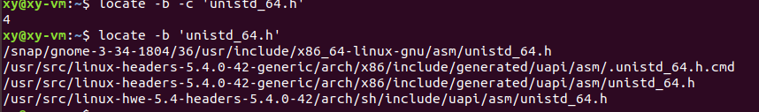
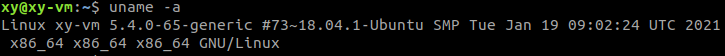

# Pre-lab

1. One source of documentation for Unix commands, system calls and library functions is the manual, made available as online *manual pages*.

   1. Open a command-line terminal and execute the command `man 1 man`. What does this command’s output tell you is the purpose of the `man` command?

      *man* is an interface to the system reference manuals. Specifically, *man* is  the  system's  manual pager. It's basically a command to access the system document.

      

   2. Referencing either the [FreeBSD handbook](https://www.freebsd.org/doc/en_US.ISO8859-1/books/handbook/basics-more-information.html) or the [Linux reference at die.net](https://linux.die.net/man), explain the difference between sections 2 and 3 of the Unix manual.

      Section 2 of the manual describes the Linux system calls. A system call is an entry point into the Linux kernel.

      Section 3 of the manual describes all library functions excluding the library functions (system call wrappers) described in section 2, which implement system calls.

      Many of the functions described in the section are part of the Standard C Library (*libc*).

      

   3. What is the difference between `write(1)` and `write(2)`?

      `write(1)` is a user command, a utility allows you to communicate with other users, by copying lines from  your terminal to theirs.

      `write(2)` is a system call, whose definition is 

      `ssize_t  write(int  fd,  const void *buf, size_t count);`

      It writes up to *count* bytes from the buffer starting  at  *buf* to the file referred to by the file descriptor *fd*.

      

2. What does the Linux `strace(1)` command do?

   to trace system calls and signals

   

3. On a 64b Linux system, use `locate(1)` to find the file `unistd_64.h`.

   1. How many instances of this file do you find?

      4 instances

      

   2. Which file is most appropriate for your use in this lab? Why? (you may find the `uname(1)` program to be helpful – how?)

      The first one - /usr/include/x86_64-linux-gnu/asm/unistd_64.h. Since this is a header file that may be used internally by `sys/syscall.h`

      `uname` can print system information. So I can use it to get the architecture type.

      

      

   3. What are the system call numbers for `open(2)`, `read(2)`, `write(2)` and `close(2)` on the x86-64 architecture?

      `open(2)`  2

      `read(2) ` 0

      `write(2)` 1

      `close(2)` 3

      

4. Consulting Linux’s inline documentation for the [`syscall`](https://github.com/torvalds/linux/blob/master/arch/x86/entry/entry_64.S#L107), [`sysenter`](https://github.com/torvalds/linux/blob/master/arch/x86/entry/entry_32.S#L882) and [legacy system call entry](https://github.com/torvalds/linux/blob/master/arch/x86/entry/entry_32.S#L1044) instructions, record which registers are used to hold the system call number and arguments for each system call mechanism:

   `syscall` is the default way of entering kernel mode on `x86-64`. This instruction is not available in 32 bit modes of operation *on Intel processors*.

   `sysenter` is an instruction most frequently used to invoke system calls in 32 bit modes of operation. It is similar to `syscall`.

|                    | `SYSCALL` | `SYSENTER` | LEGACY |
| :----------------: | :-------: | :--------: | :----: |
| System call number |    rax    |    eax     |  eax   |
|     Argument 1     |    rdi    |    ebx     |  ebx   |
|     Argument 2     |    rsi    |    ecx     |  ecx   |
|     Argument 3     |    rdx    |    edx     |  edx   |
|     Argument 4     |    r10    |    esi     |  esi   |
|     Argument 5     |    r8     |    edi     |  edi   |
|     Argument 6     |    r9     |  0(%ebp)   |  ebp   |

### System call tracing

1. Trace the system calls that are executed by the command `echo "hello"` two times. Explain the differences between these invocations. **Note:** you may find the `wdiff(1)` and `colordiff(1)` programs or the graphical `meld(1)` program helpful in your investigation.

   ```bash
   xy@xy-vm:~$ strace -o echo1.txt echo "Hello"
   xy@xy-vm:~$ strace -o echo2.txt echo "Hello"
   xy@xy-vm:~$ meld echo1.txt echo2.txt 
   ```

   The only difference is the memory address. 	

   

2. Trace the system calls executed by the command `cat /etc/fstab`. Explain the differences between this trace and those of the `echo "hello"` invocations above.

   The memory address is different. Most of systems call are the same, except at the ending, `cat` has system calls such as `openat()`, `read()` to open file and read the content of file, while `echo` only write the content that user typed. 


### System call assembly code

1. Compile the following x86 assembly code into an object file: stuff.s

   ```assembly
   	# The .data section of an object file holds, well, data! Names defined
   	# in this section will appear in the symbol table as global variables.
   	.data
   
   message:
   	.ascii "Hello, world!\n"
   
   	# The .text section contains instructions. The name is "text" for...
   	# historical reasons.
   	.text
   
   	# Here's how we define a function in assembly! This function doesn't
   	# take any parameters, so we just start executing instructions.
   	.global	do_stuff
   
   do_stuff:
   	mov	$message, %eax
   	int	$0x80
   
   	ret
   ```

   ```bash
   $ gcc -c stuff.s
   ```

    Use `objdump(1)` to disassemble the object file. Explain any differences you observe between the disassembly and the original `.S` file.


In the disassembled object file, there is no `.ascii` or `.global` section. 

In the `do_stuff` section, the `mov` 's name isn't `$message`, instead it's a address.  In the `message` section, things are totally different from the original object file. The `objdump` translate ASCII code into something syntax correct but nonsense. 


2. Download [main.c](https://memorialu.gitlab.io/Engineering/ECE/Teaching/operating-systems/website/lab/1/main.c) and [Makefile](https://memorialu.gitlab.io/Engineering/ECE/Teaching/operating-systems/website/lab/1/Makefile) and use them to compile a complete program. Use `objdump(1)` to disassemble the complete program (hint: what does the command `grep -A` do?). Identify any differences between the `do_stuff` function in this output from that of the `stuff.o` disassembly. Use `nm(1)` to explain these differences.

First of all, put stuff.c, main.c, Makefile into one folder and `make`. 

`grep -A NUM` prints  NUM  lines  of  trailing  context after matching lines.  Places a line containing a group separator (--) between contiguous groups of matches.  As the following result shows, there are only three lines in the `stuff.o` disassembly, while there are much more in the `syscalls` disassembly. Apparently, `do_stuff` appears twice in the `syscalls` disassembly, one is the definition, another is the calling. Using `nm`, we can tell that syscalls symbols include stuff.o symbols, but have many more symbols.

```bash
$ make
clang -Weverything -g   -c -o main.o main.c
main.c:25:14: warning: unused parameter 'argc' [-Wunused-parameter]
int main(int argc, char *argv[])
             ^
main.c:25:26: warning: unused parameter 'argv' [-Wunused-parameter]
int main(int argc, char *argv[])
                         ^
2 warnings generated.
as   -o stuff.o stuff.s
clang main.o stuff.o -o syscalls

$ objdump -D stuff.o > stuff.txt
$ objdump -D syscalls > syscalls.txt

$ grep -A 6 -E 'do_stuff' *.txt
stuff.txt:0000000000000000 <do_stuff>:
stuff.txt-   0:	b8 00 00 00 00       	mov    $0x0,%eax
stuff.txt-   5:	cd 80                	int    $0x80
stuff.txt-   7:	c3                   	retq   
stuff.txt-
stuff.txt-Disassembly of section .data:
stuff.txt-
--
syscalls.txt:  4005da:	e8 4b 00 00 00       	callq  40062a <do_stuff>
syscalls.txt-  4005df:	bf 02 00 00 00       	mov    $0x2,%edi
syscalls.txt-  4005e4:	48 8d 75 d0          	lea    -0x30(%rbp),%rsi
syscalls.txt-  4005e8:	e8 73 fe ff ff       	callq  400460 <clock_gettime@plt>
syscalls.txt-  4005ed:	83 f8 00             	cmp    $0x0,%eax
syscalls.txt-  4005f0:	0f 84 16 00 00 00    	je     40060c <main+0x8c>
syscalls.txt-  4005f6:	bf ff ff ff ff       	mov    $0xffffffff,%edi
--
syscalls.txt:000000000040062a <do_stuff>:
syscalls.txt-  40062a:	b8 40 10 60 00       	mov    $0x601040,%eax
syscalls.txt-  40062f:	cd 80                	int    $0x80
syscalls.txt-  400631:	c3                   	retq   
syscalls.txt-  400632:	66 2e 0f 1f 84 00 00 	nopw   %cs:0x0(%rax,%rax,1)
syscalls.txt-  400639:	00 00 00 
syscalls.txt-  40063c:	0f 1f 40 00          	nopl   0x0(%rax)

$ nm stuff.o
0000000000000000 T do_stuff
0000000000000000 d message

$ nm syscalls
000000000060104e B __bss_start
                 U clock_gettime@@GLIBC_2.17
000000000060104e b completed.7698
0000000000601030 D __data_start
0000000000601030 W data_start
00000000004004d0 t deregister_tm_clones
00000000004004c0 T _dl_relocate_static_pie
0000000000400540 t __do_global_dtors_aux
0000000000600e18 t __do_global_dtors_aux_fini_array_entry
000000000040062a T do_stuff
0000000000601038 D __dso_handle
0000000000600e20 d _DYNAMIC
000000000060104e D _edata
0000000000601050 B _end
                 U err@@GLIBC_2.2.5
00000000004006b4 T _fini
0000000000400570 t frame_dummy
0000000000600e10 t __frame_dummy_init_array_entry
000000000040085c r __FRAME_END__
0000000000601000 d _GLOBAL_OFFSET_TABLE_
                 w __gmon_start__
0000000000400720 r __GNU_EH_FRAME_HDR
0000000000400438 T _init
0000000000600e18 t __init_array_end
0000000000600e10 t __init_array_start
00000000004006c0 R _IO_stdin_used
00000000004006b0 T __libc_csu_fini
0000000000400640 T __libc_csu_init
                 U __libc_start_main@@GLIBC_2.2.5
0000000000400580 T main
0000000000601040 d message
                 U printf@@GLIBC_2.2.5
0000000000400500 t register_tm_clones
0000000000400490 T _start
0000000000601050 D __TMC_END__
```


3. Trace the system calls executed by the complete program. Explain any differences from the echo "hello" traces.

```bash
$ strace -o hello.txt echo "hello"
$ strace -o syscalls.txt ./syscalls 
$ meld hello.txt syscalls.txt 
```


The first half parts of these two files respectively are near the same, except for the address. 

However, the second half parts are different to large degree. `syscalls` has a new system call clock_gettime and calls itself, while `hello` has openat, mmap exclusively. And the sequence of system calls is different. 


4. With the complete program’s disassembly open in another window, run the program under lldb(1), breaking execution at the do_stuff function. Single-step to the int $0x80 instruction and print the contents of all registers using the register read command. Interpret these registers, providing the value of the system call number that is being executed and its arguments. Show how the system call number matches what you observed in the system call trace (the arguments are unlikely to match: you will find that they change every time you run the program depending on addresses left in registers at the time of the do_stuff call).

```shell
$ lldb ./syscalls
(lldb) target create "./syscalls"
Current executable set to './syscalls' (x86_64).
(lldb) b do_stuff 
Breakpoint 1: where = syscalls`do_stuff, address = 0x000000000040062a
(lldb) r
Process 5949 launched: './syscalls' (x86_64)
Calling do_stuff()!
Process 5949 stopped
* thread #1, name = 'syscalls', stop reason = breakpoint 1.1
    frame #0: 0x000000000040062a syscalls`do_stuff
syscalls`do_stuff:
->  0x40062a <+0>: movl   $0x601040, %eax           ; imm = 0x601040 
    0x40062f <+5>: int    $0x80
    0x400631 <+7>: retq   
    0x400632 <+8>: nopw   %cs:(%rax,%rax)
(lldb) si
Process 5949 stopped
* thread #1, name = 'syscalls', stop reason = instruction step into
    frame #0: 0x000000000040062f syscalls`do_stuff + 5
syscalls`do_stuff:
->  0x40062f <+5>:  int    $0x80
    0x400631 <+7>:  retq   
    0x400632 <+8>:  nopw   %cs:(%rax,%rax)
    0x40063c <+18>: nopl   (%rax)
(lldb) register read
General Purpose Registers:
       rax = 0x0000000000601040  message
       rbx = 0x0000000000000000
       rcx = 0x00007ffff7ffb99a  [vdso]`clock_gettime + 74
       rdx = 0x0000000000000000
       rdi = 0x0000000000000002
       rsi = 0x00007fffffffdf00
       rbp = 0x00007fffffffdf20
       rsp = 0x00007fffffffded8
        r8 = 0x0000000000000000
        r9 = 0x0000000000000000
       r10 = 0x0000000000000003
       r11 = 0x0000000000000246
       r12 = 0x0000000000400490  syscalls`_start
       r13 = 0x00007fffffffe000
       r14 = 0x0000000000000000
       r15 = 0x0000000000000000
       rip = 0x000000000040062f  syscalls`do_stuff + 5
    rflags = 0x0000000000000246
        cs = 0x0000000000000033
        fs = 0x0000000000000000
        gs = 0x0000000000000000
        ss = 0x000000000000002b
        ds = 0x0000000000000000
        es = 0x0000000000000000
```

Refer to the system call number and arguments table, 

- register `%rax` stores the system call number  0x601040, 
- `%rdi` stores the Argument1 0x02, 
- `%rsi` stores the Argument2 0x00007fffffffdf00, 
- `%rdx` stores the Argument3 0
- `%r10` stores the Argument4 0x03
- `%r8` stores the Argument5 0
- `%r9` stores the Argument6 0

In the system call trace, the corresponding line is:

```tex
syscall_0x601040(0x2, 0x7fff47780200, 0, 0x3, 0, 0) = -1 (errno 38)
```

the system call number is used in the function name, all arguments equals except for Argument2.


### Invoking system calls

1. Modify stuff.s to cause `do_stuff` to print your names to stdout. Provide your source code and explain the modifications you made.

   since we make a system call by calling interrupt `$0x80` using the `int` instruction, according to [Wiki](https://en.wikibooks.org/wiki/X86_Assembly/Interfacing_with_Linux#syscall), we should use the system call numbers from `unistd_32.h` and registers as follows:

   

   ```assembly
           .data
   message:
           .ascii "Xinyu Jian\n"
   
           .text
   
           .global do_stuff
   
   do_stuff:
           mov     $4, %eax        # sys_write system call
           mov     $1, %ebx        # stdout file descriptor
           mov     $message, %ecx  # bytes to write
           mov     $11, %edx       # number of bytes to write
           int     $0x80           # perform system call
           ret
   ```

   

2. Modify your program to use the `syscall` instruction instead of `int $0x80`. Explain your modifications.

   Since `syscall` is in x86_64 architecture, so we use the system call numbers from `unistd_64.h` and registers as follows:

   

   ```bash
           .data
   message:
           .ascii "Xinyu Jian\n"
   
           .text
   
           .global do_stuff
   
   do_stuff:
           mov     $1, %rax        # write system call
           mov     $1, %rdi        # stdout file descriptor
           mov     $message, %rsi  # bytes to write
           mov     $11, %rdx       # number of bytes to write
           syscall                 # perform system call
           ret
   
   ```

   for future use, we make a new file named `stuff_64.s` and change `Makefile` if we want to compile it. 

   

3. Modify main.c to print out the total time that elapses in the `do_stuff` call. Use the `ministat(1)` program to describe the distribution of the execution times for the version of `do_stuff` that uses `syscall` and the variant that uses `int $0x80`. `syscall` is the newer instruction — what can you infer about the motivation for its introduction?

   ```C
   int main(int argc, char *argv[])
   {
           struct timespec begin, end;
           FILE *fptr;
           long long int time;
           fptr = fopen("time_syscall.txt","w");
           if(fptr == NULL)
           {
                   printf("ERROR!");
                   exit(1);
           }
           printf("Calling do_stuff()!\n");
           for(int i = 0; i < 1000; i++)
           {
   
                   clock_gettime(CLOCK_PROCESS_CPUTIME_ID,&begin);
                   do_stuff();
                   clock_gettime(CLOCK_PROCESS_CPUTIME_ID,&end);
                   time =  end.tv_nsec - begin.tv_nsec;
                   fprintf(fptr, "%lli\n", time);
           }
           printf("Back in main() again.\n");
           fclose(fptr);
           return 0;
   }
   ```

   the above code will run `do_stuff()` 1000 times and store the running time into a file named `time_syscall.txt`, which means we used `syscall` in `do_stuff()`. When we want to count the time for `int $0x80`, we should change the file name into `time_int.txt`.

   After running `./syscalls` for both versions, we have two .txt files. Then use `ministat` to inspect.

   ```bash
   $ ministat -A -s -w 60 time_syscall.txt time_int.txt 
   x time_syscall.txt
   + time_int.txt
       N           Min           Max        Median           Avg        Stddev
   x 1000          1801       9928209          2016     14649.472     324341.11
   + 1000          2020      12912814          2410     16549.645     408601.52
   No difference proven at 95.0% confidence
   
   ```

   `syscall` is approximately 20 ns faster than `int $0x80`. Thus, one of motivations to use `syscall` is to improve the performance and reduce the time. Given that `syscall` is a very often used instruction, a small time saving may cause some overall performance improvement. 

   

4. Modify your program to open a file (e.g., `/etc/fstab`), read up to 4096 B of its contents into a buffer, print them to stdout and close the file descriptor. Explain your work and demonstrate that how it works.

   ```c
   #include <sys/stat.h>
   #include <fcntl.h>
   #include <unistd.h>
   
   #define SIZE 4096
   
   int main()
   {
           int fd = open("hamlet.txt", O_RDONLY);  // open a file, read only, fails if not found
           if(fd == -1){                           // check for errors on open
                   perror("Failed to open file\n");
           }
   
           char buffer[SIZE];
           int bytes_read = read(fd, buffer, SIZE);// read up to 4096 B of file's contents into a buffer
           write(STDOUT_FILENO, buffer, bytes_read);// write to the screen
           int result = close(fd);                 // close the file associated with fd
           if(result == -1){                       // check for eerors on close
                   perror("Failed to close the file\n");
           }
   }
   
   ```

   1. open a file and read only, return a file descriptor. 

   2. check if open successfully.
   3. create a char array buffer with specified size.
   4. read up to 4096 bytes from a file descriptor into the buffer.
   5. close the file descriptor.
   6. check if close successfully.

we store this code as `file.c`, then compile and run it. Note that we need to put the text file `hamlet.txt` within the same directory. 

```bash
$ gcc -c file file.c
$ ./file
FIRST 4096 Bytes from Hamlet...
```

