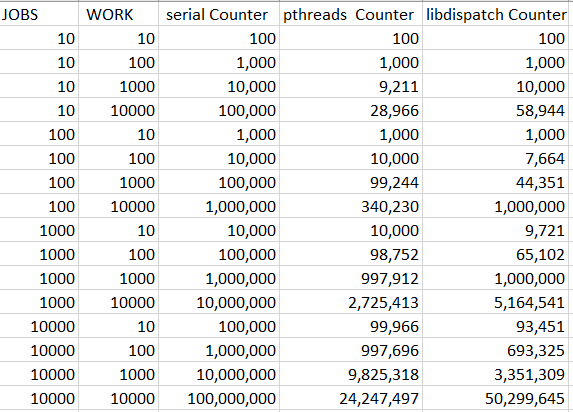

# Threading Lab Report - Xinyu Jian 

## Purpose and outcomes

The goal of this lab is to explore two models for Unix userspace multithreading: POSIX threads and libdispatch. By the end of this lab you should be able to:

1. use POSIX threading primitives to write multithreaded programs,
2. explore the kernel threading behaviour of such a program and
3. compare the performance of alternative threading models for different workloads.

## Preparation

### Prelab

Answer all of the following questions. Provide evidence for your claims.

1. What is the underlying type of a `pthread_t`? What is its meaning? When is a `pthread_t` unique? When may it be reused?

   On my system - Ubuntu 18.04.5 LTS, `phthread_t` is defined as follows:

   ```C
   /* Thread identifiers.  The structure of the attribute type is not
      exposed on purpose.  */
   typedef unsigned long int pthread_t;
   ```

   A thread ID is represented by the `pthread_t` data type. But the implementations can use different structures, which is system independent[^1]. 

   > - Linux 3.2.0 uses an unsigned long integer for the pthread_t data type. 
   >
   > - Solaris 10 represents the pthread_t data type as an unsigned integer. 
   > - FreeBSD 8.0 and Mac OS X 10.6.8 use a pointer to the pthread structure for the pthread_t data type.

   Unlike the process ID, which is unique in the system, the thread ID has significance only within the context of the process to which it belongs[^1]. According to the `man pthread_self`:

   > Thread IDs are guaranteed to **be unique only within a process**.  A thread ID may be reused after a terminated thread has been joined, or a detached thread has terminated.

   

2. What is a *thread-safe* function? Provide an example implementation of a simple C function that is **not** thread-safe and an improved version that **is** thread-safe.

   > A function is said to be thread-safe if and only if it will always produce correct results when called repeatedly from multiple concurrent threads.  [^2]

   A class of thread-unsafe functions are functions that do not protect shared variables. Here is an example:

   ```c
   volatile long cnt = 0;
   void *thread(void *vargp){
       long i, niters = *((long *)vargp);
       for(i = 0; i < niters; i++)
           cnt++;
       return NULL;
   }
   ```

   the result of `cnt` is unpredictable. 

   We can use semaphores to implement mutual exclusion:

   ```c
   volatile long cnt = 0;
   sem_t mutex;
   void *thread(void *vargp){
       long i, niters = *((long *)vargp);
       for(i = 0; i < niters; i++){
           P(&mutex);
        	cnt++;   
           V(&mutex);
       }        
       return NULL;
   }
   ```

   Note that we should initialize `mutex` to unity in the main routine:

   ```c
   sem_init(&mutex, 0, 1);
   ```

   

3. Given the following C structure:

   ```c
   struct foo
   {
           unsigned int    f_count;
           pthread_mutex_t   f_lock;
   };
   ```

   1. Implement a function `void increment(struct foo *)`, which increments the `f_count` field in a thread-safe manner.

   2. Implement the function `struct foo * foo_create(void)`.

      ```c
      void increment(struct foo f)
      {
          pthread_mutex_lock(&f.f_lock);
          f.f_count++;
          pthread_mutex_unlock(&f.f_lock);
      }
      
      struct foo * foo_create(void)
      {
          struct foo *f = malloc(sizeof(struct foo *));
          f->f_count = 0;
          int rc = pthread_mutex_init(&f->f_lock, NULL);
          assert(rc == 0); // check if init successes
          return f;
      }
      ```

      

4. Read the first three sections of [Apple’s `libdispatch` tutorial](https://apple.github.io/swift-corelibs-libdispatch/tutorial) (up to, and including, "Defining work items: Functions and Blocks"). How do the C blocks described in this document compare to C++11 lambda functions?

   From the definition, they perform similar abilities. 

   > a block as a snippet of code that can be passed around and executed like a function where it is required.

   > a lambda expression, or lambda, is a convenient way of defining an anonymous function object (a closure) right at the location where it is invoked or passed as an argument to a function. Typically lambdas are used to encapsulate a few lines of code that are passed to algorithms or asynchronous methods.[^3]

   From the syntax, they look similar. Both of them

   - have arguments
   - can specify return types
     - block defines return types after the caret (\^)[^4]
     - lambda defines return types using trailing-return-type Optional
   - can be assigned to variables, and then invoked using the variable name

   ```C
   // define a block
   void (^speak)() = ^(char *x){ printf("%s %s\n", greeting, x); };
   // defien a lambda
   auto f1 = [](int x, int y) { return x + y; };
   ```

   

## Procedure

### Serial execution

Download the C source file [serial.c](https://memorialu.gitlab.io/Engineering/ECE/Teaching/operating-systems/website/lab/2/serial.c). What does it do? Using the provided [Makefile](https://memorialu.gitlab.io/Engineering/ECE/Teaching/operating-systems/website/lab/2/Makefile), compile the source file into an executable program and run it. How long is required to execute each unit of work?

```bash
xy@xy-vm ~/D/E/lab2> ./serial
Counted to 100 in 1,928 ns: 19.280000 ns/iter
```

Using the `awk(1)` program, filter the output of your program to keep only the time per work unit, outputting the result into a file:

```console
$ ./serial | awk '{ print $7 }' | tee -a initial-serial-times.dat
```

Use the shell to run this command 999 more times. Using `head(1)` and `ministat(1)`, report the average and standard deviation for the first 3, 5, 10, 100 and 1000 runs. Comment on the significance of the number of measurements when measuring physical phenomena.

```bash
$ for i in $(seq 1000); do ./serial | awk '{ print $7 }' | tee -a initial_serial_times.dat; done

$ for i in {3,5,10,100,1000}; do head -$i initial_serial_times.dat | ministat -A -s; done
x <stdin>
    N           Min           Max        Median           Avg        Stddev
x   3         12.71         26.99         26.91     22.203333     8.2215651
x <stdin>
    N           Min           Max        Median           Avg        Stddev
x   5         12.71         26.99         23.49        22.578     5.8413629
x <stdin>
    N           Min           Max        Median           Avg        Stddev
x  10         12.71         26.99         18.36         18.88     5.7357844
x <stdin>
    N           Min           Max        Median           Avg        Stddev
x 100         11.02         29.08         17.64        17.878     3.8285717
x <stdin>
    N           Min           Max        Median           Avg        Stddev
x 1000         10.26        327.97          17.4      18.83886     12.390978
```

Normally, the larger measurment numbers, the better. Because there are inevitablely some random errors, increaing the number of measurments can offset these random errors.

However, here we observed a tradeoff. 

With the number of measurements increase, we are highly likely to have bad data, e.g., we have Max data point 327.97 with N=1000, which will dramatically influence the Standard Deviation. The Average didn't change alot compared with N=100, because this time we don't have several really really bad points. If we're no lucky, e.g., with Max point 10000, then the Average will change a lot. Since the number of bad points are small, they don't influence Median very much. By observation, N=100 is a relatively good choice. 


Explore the behaviour of this program by measuring the average per-unit-of-work execution time over varying values of `JOBS` and `WORK_PER_JOB`. For example, to delete (`clean`) the current version of the `serial` program and compile a new version with `JOBS` set to 100 and `WORK_PER_JOB` set to 100, you can run the following command:

```shell
$ make JOBS=100 WORK_PER_JOB=100 clean serial
```

How does the execution time vary with respect to `JOBS` and `WORK_PER_JOB`?

To simplify the command, I wrote the bash script:

```bash
#!/bin/bash
JOB=${1?Error: no JOBS given}
WORK=${2?Error: no WORK_PER_JOB given}
make JOBS=$JOB WORK_PER_JOB=$WORK clean serial
export PATH="~/Documents/ENGI9875/lab2:$PATH"
echo $PATH
for i in $(seq 100)
do
        serial | awk '{ $7 }' | tee -a initial_serial_times.dat
done

for i in {5,10,100}
do 
        head -$i initial_serial_times.dat | ministat -A -s
done
```
And save it as `lab.sh`

Since N=100 is a good choice, I only run 100 times and calculate their statistics attributes.

At first,  I increased `WORK_PER_JOB` solely, set `JOBS=10 WORK_PER_JOB=100`:

```shell
$ ./lab.sh 10 100
```
Then change `JOBS` solely. Finally, change both. Here are results:


It is very clear that with the increase of `JOBS` and `WORK_PER_JOB`, the execution time is decreasing. Here are possible reasons:

- there are some basic time consumption. The increased execution number will dilute this effect.
- system schedules better when the execution number increase. 


### POSIX threads

> Presenting complex data:
Your computer should have [R](https://www.r-project.org/), a statistical analysis program, installed (you can start an R GUI session by running `R --gui=Tk`). R is not the only way to present statistical information, but it can draw boxplots, violin plots, 3D surface plots and contour plots. It’s a useful tool to learn.

Copy `serial.c` to a new file called `pthreads.c`; add it to the `Makefile`. Modify this new file to execute the work in parallel using `JOBS` threads (note: do **not** use your thread-safe `increment` implementation from the prelab — that will come in later). As you did in the previous section, measure the average time to complete each unit of work for varying values of `JOBS` and `WORK_PER_JOB`. Present these results using appropriate graphical techniques. Also plot *throughput speedup* vs number of parallel threads.

Please refer to [Appendix](#posix-threads-code) for the modified code. Also, in order to avoid typing the same commands again and again, I improved the bash script, as shown in the [Appendix](#bash-script). To better plot, refer to [Appendix](#r) to see how I plot using R. The followings are raw data and plot. As we can see, when `WORK_PER_JOB` is small, the improvement that increasing `JOBS` brings is significant. However, when `WORK_PER_JOB` is big, e.g., 10000, increasing `JOBS` will also increase the average time. The reason might partly be the synchronizatoin error.


### libdispatch

Copy `serial.c` to a new file called `libdispatch.c`; add it to the `Makefile` as well. Modify this new file to execute the work using `libdispatch` with `JOBS` asynchronous jobs. As you did in the previous section, measure the average time to complete each unit of work for varying values of `JOBS` and `WORK_PER_JOB`. Present these results using appropriate graphical techniques.

The modified code is shown in [Appendix](#libdispatch-code). Here are results:


### Race conditions

Modify all three of your programs to print the actual value of `counter` rather than `JOBS * WORK_PER_JOB`. Explore how this value changes for varying values of `JOBS` and `WORK_PER_JOB` for both POSIX threads and `libdispatch`. Finally, modify your parallel programs to ensure that the correct value is counted. Plot throughput speed vs number of parallel threads in the POSIX case. Discuss your observations.

Running multiple times with different `JOBS` and `WORK_PER_JOB` with each program. the result are as follows:



Apparently, when `JOB*WORK_PER_JOB` becomes big, the POSIX thread counter and the libdispatch counter wouldn't perform as we expected. In addition, we have different values each time. This is called sychronization error[^5]. Because the counter loop actually have several instructions. 

> each concurrent execution defines some total ordering (or interleaving) of the in-
structions in the different threads. Unfortunately, some of these orderings will produce
correct results, but others will not.

Then I modified the `pthreads.c` to make it thread-safe, as shown in [Appendix](#posix-threads-code). Then thee counters are correct. Here is the plot:


As we observed before, it works well when  `WORK_PER_JOB` is small, the improvement that increasing `JOBS` brings is significant. However, when `WORK_PER_JOB` is big, increasing `JOBS` even has bad effects. But that is acceptable, since the absolute value of `Throughput`  is small. It might because some random errors. 

[^1]: https://www.informit.com/articles/article.aspx?p=2085690&seqNum=3
[^2]: CSAPP 3rd Section 12.7.1 
[^3]: https://docs.microsoft.com/en-us/cpp/cpp/lambda-expressions-in-cpp?view=msvc-160
[^4]: https://livebook.manning.com/book/objective-c-fundamentals/chapter-13/22 
[^5]: CSAPP 3rd Section 12.5

## Appendix
### POSIX threads code
pthreads.c: thread unsafe

To make it thread safe, uncomment comments.
```c
#include <err.h>
#include <locale.h>
#include <stdio.h>
#include <stdlib.h>
#include <time.h>
#include <pthread.h>
#include <string.h>

void *increment(void *vargp);
// volatile pthread_mutex_t plock;
int main(void)
{
	int counter = 0;
	struct timespec begin, end;
	pthread_t **tids = malloc(sizeof(pthread_t *)*JOBS);
	// int rc1 = pthread_mutex_init(&plock, NULL);
	// if(rc1 != 0)
	// {
	// 	fprintf(stderr, "pthread_init error: %s\n", strerror(rc1));
	// 	exit(0);
	// }
    
	for(int i = 0; i < JOBS; i++){
		tids[i] = malloc(sizeof(pthread_t));		
	}

	setlocale(LC_NUMERIC, "");

	if (clock_gettime(CLOCK_PROCESS_CPUTIME_ID, &begin) != 0)
	{
		err(-1, "Failed to get start time");
	}

	for(int i = 0; i < JOBS; i++){
              int rc2 = pthread_create(tids[i], NULL, increment, &counter);
              if(rc2!=0)
              {
                      fprintf(stderr, "pthread_creat error: %s\n", strerror(rc2));
                      exit(0);
              }
	}
	for (int i = 0; i < JOBS; i++) {
       		 pthread_join(*tids[i], NULL);
   	}

	if (clock_gettime(CLOCK_PROCESS_CPUTIME_ID, &end) != 0)
	{
		err(-1, "Failed to get end time");
	}

	long diff = end.tv_nsec - begin.tv_nsec;
	diff += (1000 * 1000 * 1000) * (end.tv_sec - begin.tv_sec);

	printf("Counted to %'d in %'ld ns: %f ns/iter\n",
	       counter, diff, ((double) diff) / counter);

	free(tids);
	return 0;
}

void *increment(void *vargp)
{
	long *countp = (long *) vargp;
	for (int i = 0; i < WORK_PER_JOB; i++)
	{
		// pthread_mutex_lock(&plock);
		(*countp)++;
		// pthread_mutex_unlock(&plock);
	}
	return NULL;
}

```

### libdispatch code
libdispatch.c: thread unsafe


To make it thread safe, uncomment comments.
```c
#include <err.h>
#include <locale.h>
#include <stdio.h>
#include <stdlib.h>
#include <time.h>
#include <dispatch/dispatch.h>

void *increment(void *vargp);

// dispatch_semaphore_t semaphore;

int main(int argc, char *argv[])
{
    int counter = 0;
	struct timespec begin, end;
	dispatch_queue_t queue = dispatch_get_global_queue(DISPATCH_QUEUE_PRIORITY_DEFAULT, 0);
	dispatch_group_t group = dispatch_group_create();
	// semaphore = dispatch_semaphore_create(1);

	setlocale(LC_NUMERIC, "");

	if (clock_gettime(CLOCK_PROCESS_CPUTIME_ID, &begin) != 0)
	{
		err(-1, "Failed to get start time");
	}

	for (int i = 0; i < JOBS; i++)
	{
		dispatch_group_async_f(group, queue, &counter, increment);
	}
	dispatch_group_wait(group, DISPATCH_TIME_FOREVER);

	if (clock_gettime(CLOCK_PROCESS_CPUTIME_ID, &end) != 0)
	{
		err(-1, "Failed to get end time");
	}

	long diff = end.tv_nsec - begin.tv_nsec;
	diff += (1000 * 1000 * 1000) * (end.tv_sec - begin.tv_sec);

	printf("Counted to %'d in %'ld ns: %f ns/iter\n",
	       counter, diff, ((double) diff) / counter);

	return 0;
}

void *increment(void *vargp)
{
	long *countp = (long *) vargp;
	for (int i = 0; i < WORK_PER_JOB; i++)
	{
		// dispatch_semaphore_wait(semaphore, DISPATCH_TIME_FOREVER);
		(*countp)++;
		// dispatch_semaphore_signal(semaphore);
	}
    return NULL;
}

```

### Bash script
lab.sh
```bash
#!/bin/bash
export PATH="~/Documents/ENGI9875/lab2:$PATH"
name=${1? Type error}

rm -f ${name}.dat
# redirect it to /dev/null to not write to the standard output
printf "JOBS\t WORK\t N\t Min\t Max\t Median\t Average\n" | tee -a ${name}.dat > /dev/null
for j in 10 100 1000 10000
do
	for w in 10 100 1000 10000
	do
		make clean
		make JOBS=$j WORK_PER_JOB=$w

		for i in $(seq 100)
		do
			${name} | awk '{printf"%s\n", $7}' | tee -a ${name}_times.dat > /dev/null
		done
		
		
		for i in 100
		do 
			printf "%d\t %d\t" $j $w | tee -a ${name}.dat
			head -$i ${name}_times.dat | ministat -A -s | awk 'NR>2{printf "%s\t%.1f\t%.1f\t%.1f\t%.1f\n", $2, $3, $4, $5, $6}'| tee -a ${name}.dat
		done

	done
done

# used for `Race conditions` 
# rm -f race.dat
# printf "JOBS\t WORK\t Counter\n" | tee -a race.dat
# for j in 10 100 1000 10000
# do
# 	for w in 10 100 1000 10000
# 	do
# 		make clean
# 		make JOBS=$j WORK_PER_JOB=$w
# 		printf "%d\t %d\t" $j $w | tee -a race.dat
# 		${name} | awk '{printf "%s\n", $3}' | tee -a race.dat
# 	done
# done
```
### Makefile
```makefile
BINARIES=\
	 serial pthreads libdispatch


JOBS?=		1000
WORK_PER_JOB?=	1000

CC=		clang	
CFLAGS=		-D JOBS=${JOBS} -D WORK_PER_JOB=${WORK_PER_JOB} \
			-Weverything -Wno-unused-parameter -g

# We don't need to link all of the following libraries for every program that
# we're going to compile, but there's no harm in attempting to do so
# (the linker will ignore any code it isn't looking for):
LDFLAGS = -ldispatch -pthread

all: ${BINARIES}


clean:
	rm -f ${BINARIES}
	rm -f serial_times.dat
	rm -f pthreads_times.dat
	rm -f libdispatch_times.dat
```
### R

```R
library(ggplot2)
library(rlist)
raw = read.table("~/Documents/ENGI9875/lab2/pthreads.dat", skip = 1)
# raw = read.table("~/Documents/ENGI9875/lab2/libdispatch.dat", skip = 1)

df = as.data.frame.matrix(raw) 
JOBS <- df$V1
WORK <- df$V2
Average <- df$V7

ggplot(df,aes(log(JOBS, 10), Average, group = WORK, color=WORK)) + geom_line()
ggplot(df,aes(log(WORK, 10), Average, group = JOBS, color=JOBS)) + geom_line()

Throughput <- vector(mode="numeric", length=0)
Number_of_pthreads <- vector(mode="numeric", length=0)
for(i in 1:dim(df)[1]){
  if(!i%%4){
    dem = Average[4]
  }
  else
    dem = Average[i%%4]
  Throughput <- c(Throughput, 1- Average[i]/dem) 
}

ggplot(df,aes(log(JOBS,10), Throughput, group = WORK, color=WORK)) + geom_line()

```