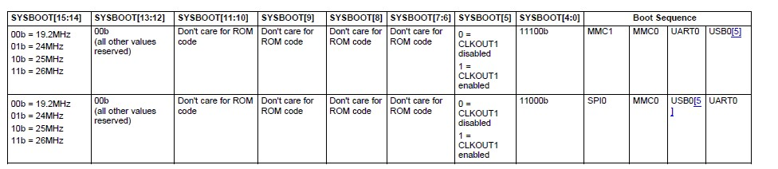

# BOOTSTRAPPING

In which you will inspect and modify a bootloader for an embedded system.

## Purpose and outcomes

The process of starting software execution on a physical platform — booting [[1](https://memorialu.gitlab.io/Engineering/ECE/Teaching/operating-systems/website/lab/4/#_footnote_1)] — is not trivial. In this lab we will investigate the early boot process for the BeagleBoneBlack board. Observing this low-level hardware/software interaction will require using (and learning about) a number of practical concepts and tools:

- the embedded system / SoC boot process
- disk partitioning
- Unix tools relevant to embedded systems
- Das U-Boot, a commonly-used bootloader

After completing this lab, you should have a good understanding of what happens in an embedded system from power-on to the beginning of OS boot.

## Preparation

Answer all of the following questions. **Explain and provide evidence for your claims.**

If you are doing this lab on Ubuntu 18.04, you will need to install the [`gcc-arm-none-eabi`](https://launchpad.net/ubuntu/+source/gcc-arm-none-eabi) package (`apt install gcc-arm-none-eabi`). Completing this lab on macOS is not supported, but it may work if you install [the `gcc-arm-embedded` cask from Homebrew](https://github.com/Homebrew/homebrew-cask/blob/master/Casks/gcc-arm-embedded.rb). On recent versions of macOS you will need to open the `arm-none-eabi-objdump` binary explicitly to override default security settings, as that binary isn’t signed.

### BeagleBoneBlack boot overview

Familiarize yourself with the following reference documents:

- §6.7 of the [BeagleBoneBlack System Reference Manual](https://github.com/beagleboard/beaglebone-black/wiki/System-Reference-Manual#boot-configuration)(BBB SRM)
- §26.1.6 of the [TI AM335x and AMIC110 Sitara processors Technical Reference Manual (TRM)](https://www.ti.com/lit/ug/spruh73q/spruh73q.pdf)(AM335x TRM)
- §3.1.1.2.2 of the [TI Processor SDK reference](https://software-dl.ti.com/processor-sdk-linux/esd/docs/latest/linux/Foundational_Components_U-Boot.html#general-information)

Using these reference documents, answer the following questions.

1. According to §3.1.1.2.2, paragraph "Boot Flow" of the TI Processor SDK reference, what are the four stages of the bootloading process for an AM335x processor?

   1. ROM Code:  the first block of code that is automatically run on device start-up or after power-on reset (POR). It is hardcoded into the device and cannot be changed by the user. The ROM code has two main functions:

   - Configuration of the device and initialization of primary peripherals
   - Readies the device for next bootloader

   2. SPL (Secondary Program Loader) or MLO (MMC Card Loader): the first stage of U-Boot, and must be loaded from one of the boot sources into internal RAM. The SPL has very limited configuration or user interaction, and mainly serves to initialize the external DDR memory and set-up the boot process for the next bootloader stage: U-Boot.

   3. U-Boot: U-Boot allows for powerful command-based control over the kernel boot environment via a serial terminal. The user has control over a number of parameters such as boot arguments and the kernel boot command. In addition, U-Boot environment variables can be configured.

   4. Linux Kernel: The loading of the kernel image is typically performed through the use of scripts stored in the U-Boot environment.

      

2. According to Figure 39 of the BBB SRM or Table 26-7 of the AM335x TRM, which device will the processor boot ROM first attempt to boot from if pins SYSBOOT[4:0] are set to 11100b?

   

   the processor will first look for the **eMMC** on the MMC1 port.

   

3. According to §26.1.8.5 of the AM335x TRM:

   1. Where can the MMC LOader (MLO) be found on the internal or external SD Card / MultiMediaCard (MMC) in FAT mode?

      It is only located in the **root directory** on an active primary partition of type FAT12/16 or FAT32. For a FAT12/16 file system, the Root Directory has a fixed location which is cluster 0. For a FAT32 file system, its cluster location is given by *BPB_RootClus*. To 

      

   2. What is a Master Boot Record (MBR)?

      The Master Boot Record is the 1st sector of a memory device. It is made out of some executable code and 4 partition entries

      

   3. What bytes would be recognized by the AM335x as a valid boot Partition Type within an MBR Partition Entry?

      - 01h for FAT12

      - 04h, 06h, 0Eh for FAT16 
      - 0Bh, 0Ch, 0Fh for FAT32

### Disk partitions

Using the [Wikipedia entry on partition types](https://en.wikipedia.org/wiki/Partition_type) [[2](https://memorialu.gitlab.io/Engineering/ECE/Teaching/operating-systems/website/lab/4/#_footnote_2)], answer the following questions.

1. Which partition IDs are used for the various flavours of FAT (File Allocation Table) filesystems?

   ​    FAT12 - 0x01
   ​	FAT16 - 0x04
   ​	FAT16B - 0x06
   ​	exFAT - 0x07
   ​	Logical sectored FAT12/FAT16 (Commodore) - 0x08
   ​	FAT32 (CHS) - 0x0B
   ​	FAT32 (LBA) - 0x0C
   ​	FAT16B (LBA) - 0x0E
   ​	Logical sectored FAT12/FAT16 (Leading Edge) - 0x11
   ​	Hidden FAT12 (IBM) - 0x11
   ​	Bootable FAT - 0x12
   ​	Logical sectored FAT12/FAT16 (AST) - 0x14
   ​	Hidden FAT16 (IBM) - 0x14
   ​	Hidden FAT16B (IBM) - 0x16
   ​	Hidden exFAT (IBM) - 0x17
   ​	Hidden FAT32 (IBM) - 0x1B
   ​    Hidden FAT32 with LBA (corresponds with `0Ch`) - 0x1C

   ​    Hidden FAT16 with LBA (corresponds with `0Eh`) - 0x1E

   ​	Logical sectored FAT12 or FAT16(NEC) - 0x24

   ​	Logical sectored FAT12 or FAT16(ATT) - 0x56

   ​	Hidden FAT12 (corresponds to `E1h`) - 0x61

   ​	Hidden FAT16 (corresponds to `E4h`) - 0x64

   ​	Hidden read-only FAT16 (corresponds to `E6h`) - 0x66

   ​	etc

   

2. What is the difference between LBA and CHS modes? Which came first? Which is more commonly-used today? Why?

   - Cylinder-Head-Sector(CHS) was an earlier method for addressing hard disks. Sectors can be addressed by CHS coordinates (C, H, S). 

   - Logical block addressing (LBA): blocks are located by an integer index, with the first block being LBA 0, the second LBA 1, and so on.

   LBA is more commonly-used today. Because LBA is simpler. Using LBA, the hard disk is simply addressed as a single, large device, which simply counts the existing blocks starting at 0. 

   

3. Which partition ID is used for modern Linux filesystems? (give both base-10 and base-16 representations)

   Modern Linux filesystems use the ext4 filesystem. The partition ID is 0x83 - 131


4. Which partition ID is used for a [FreeBSD slice](https://www.freebsd.org/doc/handbook/disk-organization.html#basics-disk-slice-part)? (give both base-10 and base-16 representations)

   FreeBSD slices use the BSD slice filesystem. The partition ID is 0xA5 - 165

   

### Disk and file inspection tools

Questions in this section will refer to the object file [8894.o](https://memorialu.gitlab.io/Engineering/ECE/Teaching/operating-systems/website/lab/4/8894.o) (which contains the definition of a `main` function). You should download this file to a Unix-like system (BSD, MacOS, Linux, Solaris, etc.), from which you should be able to examine it with the tools below.

Consult the manual pages for the following Unix tools and answer the associated questions.

1. `dd(1)`

   1. what does this tool do?

      `dd(1)` copies a file, converting and formatting according to the operands.

      

   2. give a command line that you could use to copy 32 kib from one file to another.

      since the operand `count=N` means copy only N input blocks, one block has 512 bytes. 32 kib = 64 blocks

      ```bash
      $dd if=srcfile of=dstfile count=64
      ```

      

2. `hexdump(1)`

   1. Run `hexdump -C 8894.o | head -n12`. What do you observe in offsets 0–B0h?

      ```bash
      xy@xy-vm:~/Desktop$ hexdump -C 8894.o | head -n12
      00000000  7f 45 4c 46 01 01 01 00  00 00 00 00 00 00 00 00  |.ELF............|
      00000010  01 00 28 00 01 00 00 00  00 00 00 00 00 00 00 00  |..(.............|
      00000020  74 01 00 00 00 00 00 05  34 00 00 00 00 00 28 00  |t.......4.....(.|
      00000030  0c 00 09 00 80 b5 00 af  40 f2 00 00 c0 f2 00 00  |........@.......|
      00000040  42 f2 be 21 ff f7 fe ff  00 23 18 46 80 bd 00 bf  |B..!.....#.F....|
      00000050  43 6f 6e 67 72 61 74 75  6c 61 74 69 6f 6e 73 20  |Congratulations |
      00000060  6f 6e 20 63 6f 6d 70 6c  65 74 69 6e 67 20 45 4e  |on completing EN|
      00000070  47 49 20 25 64 21 0a 00  00 47 43 43 3a 20 28 63  |GI %d!...GCC: (c|
      00000080  72 6f 73 73 74 6f 6f 6c  2d 4e 47 20 6c 69 6e 61  |rosstool-NG lina|
      00000090  72 6f 2d 31 2e 31 33 2e  31 2d 34 2e 38 2d 32 30  |ro-1.13.1-4.8-20|
      000000a0  31 34 2e 30 34 20 2d 20  4c 69 6e 61 72 6f 20 47  |14.04 - Linaro G|
      000000b0  43 43 20 34 2e 38 2d 32  30 31 34 2e 30 34 29 20  |CC 4.8-2014.04) |
      ```

      The string ".ELF(t4(@B!#.F Congratulations on completing ENGI %d! GCC: (crosstool-NG linaro-1.13.1-4.8-2014.04 - Linaro GCC 4.8-2014.04)" 

      

   2. Read pages 4–2, 4–4, 4–5 and 4–7 of the [System V Application Binary Interface specification](https://refspecs.linuxfoundation.org/elf/gabi41.pdf), Edition 4.1 (also known as the "Generic ABI" or gABI, since it does not include architecture-specific details). Using this specification and your `hexdump(1)` output, answer the following questions, justifying your conclusions from your observations:

      1. What ELF version does [8894.o](https://memorialu.gitlab.io/Engineering/ECE/Teaching/operating-systems/website/lab/4/8894.o) conform to?

         Byte 7 tells us which version of the ELF format the file is using. Thus 8894.o conforms to the current ELF version 1 as the byte 7 is 01.

         

      2. Is it a 32- or 64-bit object file?

         Byte 5 tells us whether we’re using a the 32-bit or 64-bit ELF format. Thus it is a 32-bit object file since the byte 5 is 01.

         

      3. Is it compiled for a little- or big-endian machine?

         It is compiled for a little-endian machine since the numerical values in the header are stored with little-endianness.

         

      4. What type of object file is this (shared? executable? relocatable?)?

         Bytes 17 and 18 are a two-byte fieldm, which is the ‘type’ of our ELF file. The value is 0x0001 = 1, which is Relocatable file.

         

   3. What can you infer about the behaviour of this code, based purely on what you can see in your `hexdump(1)` output?

      The "Congratulations" string is a format print. Thus it prints "Congratulations on completing ENGI x", where x is a signed integer from the user input.

      

3. `objdump(1)`

   1. What does the `objdump -s` command do?

      It displays the full contents of the requested sections, by default displaying the contents of all non-empty sections.

      

   2. What does the `objdump -d` command do?

      It displays the assembler mnemonics for the machine instructions in the object file. Only disassembles sections which should contain instructions.


## Procedure (for extra credit)

1. Download FreeBSD’s image for the BeagleBone Black from [ftp://ftp.freebsd.org/pub/FreeBSD/releases/arm/armv7/ISO-IMAGES/12.0/FreeBSD-12.0-RELEASE-arm-armv7-BEAGLEBONE.img.xz](ftp://ftp.freebsd.org/pub/FreeBSD/releases/arm/armv7/ISO-IMAGES/12.0/FreeBSD-12.0-RELEASE-arm-armv7-BEAGLEBONE.img.xz)
2. Extract the image by executing:
   `xz -d FreeBSD-12.0-RELEASE-arm-armv7-BEAGLEBONE.img.xz` 

### Dissecting the image

1. Use the `file(1)` command to inspect the `.img` file downloaded above. Explain the results. How does the “file” command retrieve this information?

   ```bash
   xy@xy-vm:~/Downloads$ file FreeBSD-12.0-RELEASE-arm-armv7-BEAGLEBONE.img 
   FreeBSD-12.0-RELEASE-arm-armv7-BEAGLEBONE.img: DOS/MBR boot sector; partition 1 : ID=0xc, active, start-CHS (0x0,17,1), end-CHS (0x6,110,63), startsector 1071, 102312 sectors; partition 2 : ID=0xa5, start-CHS (0x6,111,1), end-CHS (0x187,158,63), startsector 103383, 6188049 sectors
   ```

   `file(1)` is used to determine file type.

   - `FreeBSD-12.0-RELEASE-arm-armv7-BEAGLEBONE.img:` the file name
   - `DOS/MBR boot sector;` **DOS** stands for Disk Operating System. **MBR** stands for Master Boot Record, which is a special type of boot sector at the very beginning of partitioned computer mass storage devices[^1].  A **boot sector** is the sector of a persistent data storage device which contains machine code to be loaded into random-access memory (RAM) and then executed by a computer system's built-in firmware (e.g., the BIOS). Usually, the very first sector of the hard disk is the boot sector. It consists of MBR，DPT (Disk Partition Table) and Boot Record ID.
   - `partition 1 : ID=0xc, active, start-CHS (0x0,17,1), end-CHS (0x6,110,63), startsector 1071, 102312 sectors;` is the information of the first disk partition. 
     - `ID=0xc`: partition ID in a partition's entry in the partition table inside a master boot record (MBR) is a byte value intended to specify the file system the partition contains or to flag special access methods used to access these partitions.
     - `active`: On MBR disk, the system reserved partition is required to be active.  An active partition is a partition on a hard drive set as the bootable partition containing the operating system. Only one partition on each hard drive can be set as an active partition or bootable partition. 
     - `start-CHS (0x0,17,1)`: the start CHS address.
     - `end-CHS (0x6,110,63)`: the end CHS address.
     - `startsector 1071`: start sector ID.
     - `102312 sectors`: partition 1 has 102312 sectors.

   `file(1)` retrieve this information by looking at the header information of the file, which is the boot sector.

   

2. Now inspect the image with `fdisk(1)`.

   1. What command did you need to execute?

      ```bash
      xy@xy-vm:~/Downloads$ fdisk -l FreeBSD-12.0-RELEASE-arm-armv7-BEAGLEBONE.img 
      Disk FreeBSD-12.0-RELEASE-arm-armv7-BEAGLEBONE.img: 3 GiB, 3221225472 bytes, 6291456 sectors
      Units: sectors of 1 * 512 = 512 bytes
      Sector size (logical/physical): 512 bytes / 512 bytes
      I/O size (minimum/optimal): 512 bytes / 512 bytes
      Disklabel type: dos
      Disk identifier: 0x00000000
      
      Device                                         Boot  Start     End Sectors Size Id Type
      FreeBSD-12.0-RELEASE-arm-armv7-BEAGLEBONE.img1 *      1071  103382  102312  50M  c W95 FAT32 (LBA)
      FreeBSD-12.0-RELEASE-arm-armv7-BEAGLEBONE.img2      103383 6291431 6188049   3G a5 FreeBSD
      ```

   2. How many partitions are available in the image file?

      2 partitions

      

   3. Which partition including the boot loader? How do you know? What is its type?

      the first partition. Because there is a * in the Boot column. Its type is W95 FAT32 (LBA).

      

   4. Where is the MBR located?

      The MBR is located on the first sector of a disk, i.e., boot sector.

      

   5. Which partition holds the installed OS? What is its type?

      the 2nd partition. Its type is FreeBSD.

### Extracting MBR

1. Using `dd(1)`, extract 1 MiB of data from the beginning of the image to a file called `mbr.bin`. Show the command you executed and evidence that it worked correctly.

   A default block in `dd(1)` command is 512B. $1MiB/512B=2048=2K$

   ```bash
   xy@xy-vm:~/Downloads$ dd if=FreeBSD-12.0-RELEASE-arm-armv7-BEAGLEBONE.img of=mbr.bin count=2K
   2048+0 records in
   2048+0 records out
   1048576 bytes (1.0 MB, 1.0 MiB) copied, 0.00647639 s, 162 MB/s
   ```

   

2. Use the `file(1)` command to inspect `mbr.bin`. Compare with the results of inspecting the `.img` file.

   ```bash
   xy@xy-vm:~/Downloads$ file mbr.bin 
   mbr.bin: DOS/MBR boot sector; partition 1 : ID=0xc, active, start-CHS (0x0,17,1), end-CHS (0x6,110,63), startsector 1071, 102312 sectors; partition 2 : ID=0xa5, start-CHS (0x6,111,1), end-CHS (0x187,158,63), startsector 103383, 6188049 sectors
   ```

   It has the same information as `file .img_file`, which proves that `file(1)` retrieve this information by looking at the first sector.

### Mounting the Boot Partition

1. Using `dd(1)`, extract the boot partition to a file called `boot.img`. Explain the command you ran.

   ```bash
   xy@xy-vm:~/Downloads$ dd if=FreeBSD-12.0-RELEASE-arm-armv7-BEAGLEBONE.img of=boot.img skip=1071 count=102312
   102312+0 records in
   102312+0 records out
   52383744 bytes (52 MB, 50 MiB) copied, 0.378313 s, 138 MB/s
   ```

   Use the above file information. Since the partition 1 starts from sector 1071, the first 1071 sector is skipped(assuming the sector number starts from 0). The length of partition 1 is 102312 sectors, so we copy 102312 input blocks.

   

2. Make an empty directory as a mount point and mount `boot.img`, executing: `mount -o loop boot.img /mnt/your-mount-dir` Show the content under the mounted directory. 

   ```bash
   xy@xy-vm:~/Downloads$ mkdir tmp
   xy@xy-vm:~/Downloads$ sudo mount -o loop boot.img ./tmp
   xy@xy-vm:~/Downloads$ ls ./tmp/
   dtb  EFI  MLO  ubldr.bin  u-boot.img
   ```

3. Using `objdump(1)`, `hexdump(1)` and `file(1)`, what information can be extracted from the file `u-boot.img?` What is the entry address of the bootloader?

   `objdump(1)` and `hexdump(1)` don't work.

   ```bash
   xy@xy-vm:~/Downloads/tmp$ file u-boot.img 
   u-boot.img: u-boot legacy uImage, U-Boot 2018.09 for am335x board, Firmware/ARM, Firmware Image (Not compressed), 409104 bytes, Fri Dec  7 01:55:55 2018, Load Address: 0x80800000, Entry Point: 0x00000000, Header CRC: 0xD0B63EDC, Data CRC: 0x3DE7011A
   xy@xy-vm:~/Downloads/tmp$ cd ..
   xy@xy-vm:~/Downloads$ sudo umount ./tmp
   ```

   The entry address of bootloader is 0x80800000.

   

------

[1](https://memorialu.gitlab.io/Engineering/ECE/Teaching/operating-systems/website/lab/4/#_footnoteref_1). For the linguistically curious, "boot" is short for ["bootstrap"](http://www.oed.com/view/Entry/21553), a word that is derived rather colourfully from the concept of pulling oneself up by one’s own bootstraps. However, there is [debate on the etymology of the word](http://listserv.linguistlist.org/pipermail/ads-l/2005-August/052756.html).

[2](https://memorialu.gitlab.io/Engineering/ECE/Teaching/operating-systems/website/lab/4/#_footnoteref_2). Wikipedia is not typically referenced as a canonical source of archival information. However, there is no authoritative listing of partition IDs, so this is about as good as we’re going to get. Another listing (no more or less authoritative) can be found [here](https://www.win.tue.nl/~aeb/partitions/partition_types.html), or alternatively, you can [use the source](https://github.com/freebsd/freebsd/blob/master/sys/sys/disk/mbr.h#L45) (Luke).

[
  ](https://memorialu.gitlab.io/Engineering/ECE/Teaching/operating-systems/website/lab/)

[^1]: https://en.wikipedia.org/wiki/Master_boot_record